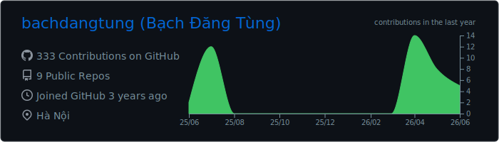
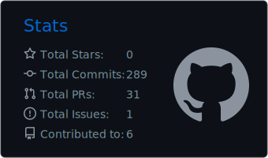

<!-- bachdangtung header banner -->

  

<h1 align="center">👋 Hi there, I'm Bach Dang Tung!</h1>

  

 

## 🛠️ Technologies and Tools

### 💻 Languages & Frontend

  
  &nbsp;
  
  &nbsp;
  
  &nbsp;
  
  &nbsp;
  
  &nbsp;
  

### ⚙️ Databases & IDEs

  
  &nbsp;
  
  &nbsp;
  
  &nbsp;
  
  &nbsp;
  

<!-- Other tools and frameworks (uncomment as needed):
- Spring Boot: 
- JWT: 
- Thymeleaf: 
- Heroku: 
- AWS: 
- Postman: 
-->

 

<!-- WORDLE:START -->
### 🎮 Profile Wordle

🎮 **Play Wordle!** Try to guess the 5-letter programming word. <a href="https://github.com/bachdangtung/bachdangtung/issues/new?title=wordle%3A+guess+%3CYOUR_GUESS_HERE%3E&body=Replace+%3CYOUR_GUESS_HERE%3E+with+a+5-letter+word+in+the+issue+title+and+click+%22Submit+new+issue%22%21"><b>Make a Guess (Click here)</b></a>

<b>Attempt 1:</b> &nbsp; ⬜ &nbsp;&nbsp;&nbsp; ⬜ &nbsp;&nbsp;&nbsp; ⬜ &nbsp;&nbsp;&nbsp; ⬜ &nbsp;&nbsp;&nbsp; ⬜

<b>Attempt 2:</b> &nbsp; ⬜ &nbsp;&nbsp;&nbsp; ⬜ &nbsp;&nbsp;&nbsp; ⬜ &nbsp;&nbsp;&nbsp; ⬜ &nbsp;&nbsp;&nbsp; ⬜

<b>Attempt 3:</b> &nbsp; ⬜ &nbsp;&nbsp;&nbsp; ⬜ &nbsp;&nbsp;&nbsp; ⬜ &nbsp;&nbsp;&nbsp; ⬜ &nbsp;&nbsp;&nbsp; ⬜

<b>Attempt 4:</b> &nbsp; ⬜ &nbsp;&nbsp;&nbsp; ⬜ &nbsp;&nbsp;&nbsp; ⬜ &nbsp;&nbsp;&nbsp; ⬜ &nbsp;&nbsp;&nbsp; ⬜

<b>Attempt 5:</b> &nbsp; ⬜ &nbsp;&nbsp;&nbsp; ⬜ &nbsp;&nbsp;&nbsp; ⬜ &nbsp;&nbsp;&nbsp; ⬜ &nbsp;&nbsp;&nbsp; ⬜

<b>Attempt 6:</b> &nbsp; ⬜ &nbsp;&nbsp;&nbsp; ⬜ &nbsp;&nbsp;&nbsp; ⬜ &nbsp;&nbsp;&nbsp; ⬜ &nbsp;&nbsp;&nbsp; ⬜

  <b>Letter Status:</b> 
  🟩 Correct: None 
  🟨 Present: None 
  ⬛ Absent: None

  <b>Last Action:</b> No guesses yet. 
  🏆 <b>Streak:</b> 0 wins (Max: 0) &nbsp;|&nbsp; ⚔️ <b>Total Games:</b> 0 (Won: 0)

  <a href="https://github.com/bachdangtung/bachdangtung/issues/new?title=wordle%3A+reset&body=Click+%22Submit+new+issue%22+to+reset+the+game%21"><b>🔄 Reset / Start New Game</b></a>

<!-- WORDLE:END -->

 

## 🔥 GitHub Stats

  
  &nbsp;&nbsp;
  

 

## 🐍 Contribution Snake

  <picture>
    <source media="(prefers-color-scheme: dark)" srcset="https://raw.githubusercontent.com/bachdangtung/bachdangtung/output/github-contribution-grid-snake-dark.svg">
    <source media="(prefers-color-scheme: light)" srcset="https://raw.githubusercontent.com/bachdangtung/bachdangtung/output/github-contribution-grid-snake.svg">
    
  </picture>

 

## 👽 Connect with Me

  
  &nbsp;&nbsp;
  
  &nbsp;&nbsp;
  

 

## 📑 Favorite Quote

  

